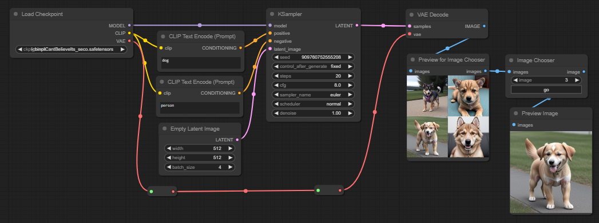
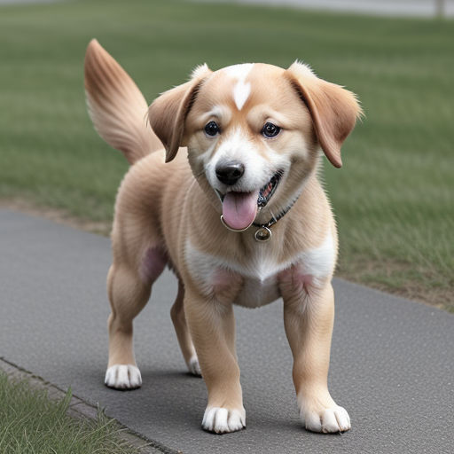
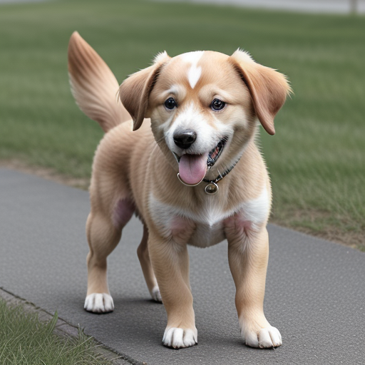
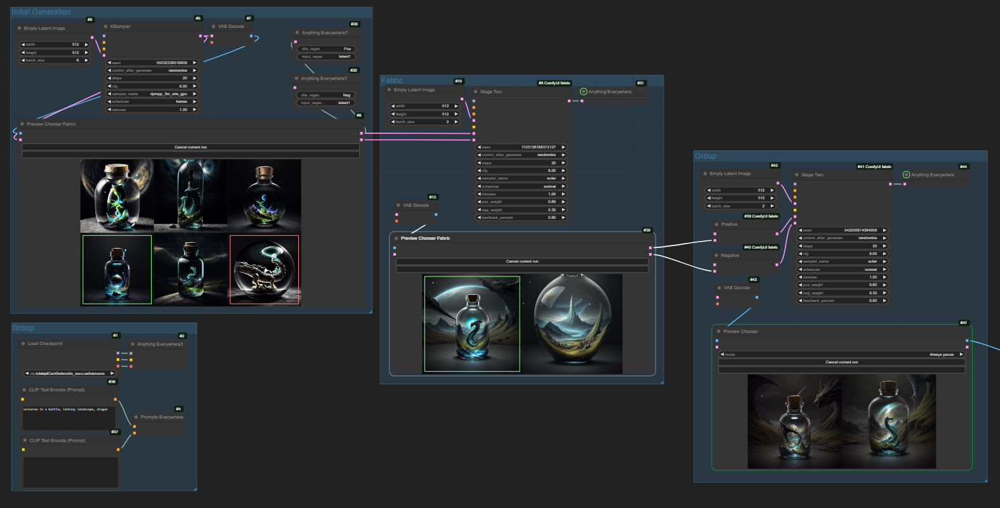

# Image Chooser

Love this node? [Buy me a coffee!](https://www.buymeacoffee.com/chrisgoringe)

A node to allow you to preview images and choose one or more to pass on to the rest of your workflow (as image or latent). 

(shameless plug for my other work - want to make your workflow cleaner - check out [UE Nodes](https://github.com/chrisgoringe/cg-use-everywhere). And leave a star if you like something!)

## Basic usage

|Here's part of a simple workflow|It's saved in this image|
|-|-|
||

This uses only regular nodes and the Unified Chooser. If you're going to try the node out, please start with this - if it doesn't work, nothing more complicated will! And it's much easier to narrow down problems on a simple workflow!

|Here's a workflow that illustrates use with both images and latents|Saved in this dog|
|-|-|
||

## Recent changes

2.13 (10 May 2024)
- [lakmeer](https://github.com/lakmeer) added Cancel on queue 

2.12 (4 April 2024)
- configure hotkeys

2.11 (26 March 2024)
- added masks

2.10 (12 March 2024)
- added `Repeat last selection`

2.9 (25 Jan 2024)
- added `Progress first pick`
- fixed a few bugs

2.8.2 (24 Jan 2024)
- hotkeys
- alert sound

2.8 (6 Dec 2023)
- added three new modes: pass through, take first n, take last n

2.7 (4 Dec 2023)
- various minor fixes
- use new JS deployment 
- add setting to control position of the HUD

2.6 (17 Oct 2023)
- added the [Preview Chooser Fabric](#preview-chooser-fabric)
- fixed some bugs with cancelling

2.5.1 - 2.5.3 (13-14 Oct 2023)
- added a cancel button
- fixed the cancel in the main menu
- removed some possible causes of incompatibility with other custom nodes.
- click on images to select them
- eliminate the right-click menu

2.5 (13 Oct 2023)
- Major update to unify the chooser and preview nodes

## Notes...

When the workflow pauses in the `Preview Chooser`, you click on the images to select / unselect them - selected images are marked with a green box. When there are one or more images selected, you can `Progress selected images` to send them out. You can cancel the run from the right-click menu on the background canvas.

Once the run finishes you can `Progress... (as restart)` to send one or more images on from the node (which has 'stashed' them). [NB _this is no longer being actively supported - if it breaks, it breaks, and it may be removed_]

You should always have the image input connected; if you have the latent input connected, the same latents are output as images (in the same order - which is actually the order in which you selected them). I *very strongly* suggest that you always pass the latents through the `Preview Chooser` - the order of node execution, and the ability to restart, are much more reliable if you do.

If you wish, you can also pass any masks used through in a similar way. You can also just pass a single mask into the chooser; it will be turned into a batch of masks the same length as the output.

You can control the position of the HUD (in the top left) using the main settings menu.

## Hotkeys

The following hotkeys are active *only when the flow is paused in a Preview Chooser node.

- `1...9` click image number `n`
- `0` click `progress selected images` if any are selected, or `cancel current run` if none selected

These hotkeys can be changed in the settings menu.

## Alert sound

There's a ping when the chooser node is waiting. You can turn in off in the main settings menu, or change the sound by replacing the file `js/ding.mp3` with any audio.

## Modes

- `Always pause` - default behaviour. Always wait for a selection
- `Repeat last selection` - As long as nothing upstream has changed, immediately send the same output as previously. If anything has changed (including first run), treat as `Always pause`
- `Only pause if batch`. Wait unless there is just one image, in which case pass it through immediately.
- `Progress first pick`. Always pause, but when an image is selected pass it through (no need to select and then click 'progress').
- `Pass through`. Just pass everything through. Same as bypassing the node.
- `Take First n`. Pass the first `n` images
- `Take Last n`. Pass the last `n` images

The last three are only really for some fairly special cases!

## Cancel on Queue

If you set this option (in the main settings), then a paused workflow will cancel when you press the queue button. Thanks to [lakmeer](https://github.com/lakmeer) for the PR.

## No, you can't change other widgets while it's waiting (but you can restart)

It's tempting to think you could edit other widgets downstream before pressing 'go' (maybe you look at an image, and then decide what denoise factor to use downstream). 

But the way ComfyUI works is that all the widget values get sent to the server at the start - so changes you make during a pause aren't applied to that run.

The exception is the chooser nodes themselves. They communicate directly with the server when you press 'go'. So their values when you started the run (which were sent to the server) are ignored in favour of the ones sent when you pressed 'go' to continue the workflow. 

But you *can* use `Repeat last selection`

## Preview Chooser Fabric

_Note that I am no longer actively supporting this, and if it breaks it may well be removed_

This node is designed for use with the [Fabric custom nodes](https://github.com/ssitu/ComfyUI_fabric), which allow you to pass latents you like and dislike from one iteration into a sampler which uses that information as a conditioning.

This node outputs two sets of latents, positive and negative. Click an image to add it to positive (green box), click again to add to negative (red box), again to clear.

Note that you *must* select at least one positive and one negative in the first round. At present you must also select at least one positive and one negative in subsequent rounds, but there's a [PR](https://github.com/ssitu/ComfyUI_fabric/pull/12) on the Fabric nodes that will allow one of positive or negative to be empty - so this *is* permitted by the chooser.

|Here's an example [workflow](docs/fabric-workflow.json). Note that you will need Use Everywhere Nodes to load this workflow - you can find them in the manager or install from [here](https://github.com/chrisgoringe/cg-use-everywhere)|An image with the workflow in|
|-|-|
|||

Note that restarting doesn't work very well (because of the dependance of the downstream nodes on all of the latents from previous choosers). It's ok, but not great.

## To install

Find it in Comfy Manager. Or:

```
cd [path to ComfyUI]/custom_nodes
git clone https://github.com/chrisgoringe/cg-image-picker.git
```

## To update

Comfy Manager. Or:

```
cd [path to ComfyUI]/custom_nodes/cg-image-picker
git pull
```


## Issues? Comments? Delight?

Raise an issue. Or give this repository a star.
