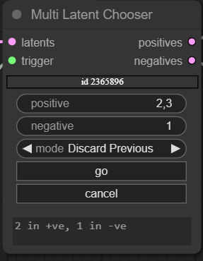
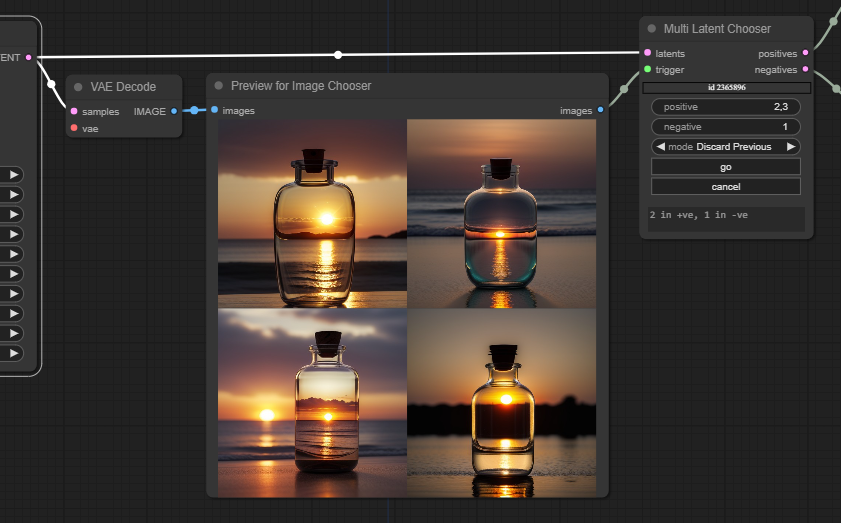

# Image Chooser

Nodes to allow you to preview images and choose one to pass on to the rest of your workflow. Suggested in response to [love_leaves_marks](https://www.reddit.com/user/Love_Leaves_Marks/) on reddit.

(shameless plug for my other work - want to make your workflow cleaner - check out [UE Nodes](https://github.com/chrisgoringe/cg-use-everywhere). And leave a star if you like something!)

## To install

Find it in Comfy Manager. Or:

```
cd [path to ComfyUI]/custom_nodes
git clone https://github.com/chrisgoringe/cg-image-picker.git
```

## To update

Comfy Manager. Or:

```
cd [path to ComfyUI]/custom_nodes/cg-image-picker
git pull
```

# Update 2.3 (5th October 2023)

- Added option to only pause for batches (let single images/latents through immediately)
- Added cancel option to preview right-click
- Fixed some bugs

# Major update (2.2, 4th October 2023)

Two new features as well as a bunch of bug-fixes. You can see them both in this screenshot...


That floating 'Cancel' button on the left? When the workflow pauses in a selection node, you get a visual indication, and you can cancel the run without having to find the node (feature inspired by [Erehr](https://github.com/chrisgoringe/cg-image-picker/issues/8)). 

And then in the `Preview for image chooser` node, there is now a right-click menu option to select this image to proceed with. So you don't have to work out what number it is - pick the best image, right click, and `Progress this image`. 

I'll be adding more options to both those features soon (`cancel and requeue`, for instance, for when you don't like any of the images).

Neither the HUD nor the right-click option should appear when the workflow isn't paused on a chooser node. But note that there are no smarts about which chooser node you are paused on, so if your workflow has multiple choosers, you'll need to work out the best way to use this.

# The Image and Latent Chooser nodes

## To use - Image Chooser

Here's a really simple example. The `Preview for Image Chooser` node is just a `Preview Image` node with an added output that passes the images on - that's just for convenience. When you run the prompt, it will pause on the `Image Chooser` until you press 'go', at which point it will pass the selected image on.


This dog has that workflow saved for you to drop onto ComfyUI:


Or just download the [workflow](docs/workflow.json)

## No, you can't change other widgets while it's waiting

It's tempting to think you could edit other widgets downstream before pressing 'go' (maybe you look at an image, and then decide what denoise factor to use downstream). 

But the way ComfyUI works is that all the widget values get sent to the server at the start - so changes you make during a pause aren't applied to that run.

The exception is the chooser nodes themselves. They communicate directly with the server when you press 'go'. So their values when you started the run (which were sent to the server) are ignored in favour of the ones sent when you pressed 'go' to continue the workflow. 

## Trigger?

The trigger input is optional, can take any input, and is ignored. You use it to ensure that an upstream node runs before this one. Mostly useful for choosing between latents (see below).

## Send a second choice?

A few people have asked if it is possible to send one output, and then another. No, it's one 'go' per run.

The way I suggest you work is have everything upstream with fixed seeds, so when you run the workflow again none of it gets repeated, then you can make a different choice.

The exception is the multiple latent chooser (WIP) - see below.

## Latent Chooser

If you want the rest of your workflow to start with the latent instead, use the `Latent Chooser` 


Here's another dog with the workflow... 


## Multiple outputs

This is a WIP - in `utilites/control/_testing` there is `Multi Latent Chooser`. This is designed to work with [Fabric](https://github.com/ssitu/ComfyUI_fabric), but you might find other uses.



It takes a *batch* of latents, and you can enter two comma separated lists of choices - 'positive' and 'negative'. The outputs are each a batch of latents just containing the ones you selected. If either list is empty, a single zero latent of the input shape is output (to avoid errors downstream).

If you select the mode `Accumulate` then the positive and negative selections from the last run will also be included - so you can accumulate latents that are good or bad over multiple runs. The text at the bottom shows how many latents have been sent on each output.

You'll probably want to use the trigger so you can check the images... like this:



Oh, and if you are wondering how the VAE Decode is working with no VAE, you should check out [UE Nodes](https://github.com/chrisgoringe/cg-use-everywhere) to get your link spaghetti under control.

## Issues? Comments? Delight?

Raise an issue. Or give this repository a star.
