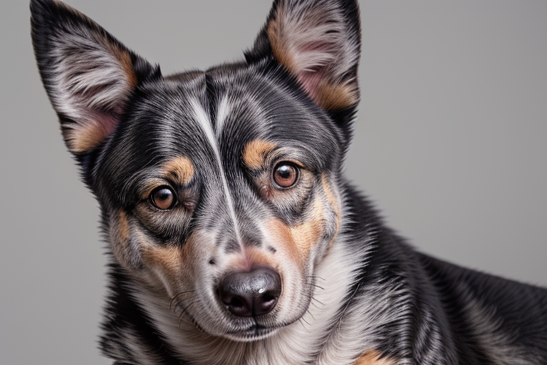
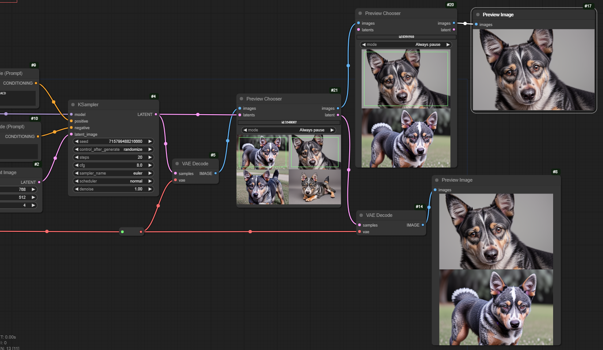

# The Unified Chooser Node

This is a work in progress...

## How to get it

If you have the image chooser custom nodes installed, you can switch to the development branch like this:

```
cd [comfy install]/custom_nodes/cg-image-picker
git switch unify-chooser
git pull
```
and restart Comfy
(to switch back, just `git switch main`)

## What is it?

A single node that combines image preview with single- or multi-pick chooser, 'restart from here', and the HUD.

This dog has a basic workflow, using only regular nodes and the Unified Chooser. If you're going to try the node out, please start with this - if it doesn't work, nothing more complicated will! And it's much easier to narrow down problems on a simple workflow!


## Notes...

This is part of that workflow


There is just one node now, the `Preview Chooser`. It has one widget control, mode - this just determines how the node behaves when there is only a single image.

When the workflow pauses in the `Preview Chooser`, you can right-click on the images to select / unselect them - selected images are marked with a green box. When there are one or more images selected, you can `Progress selected images` to send them out. You can also cancel the run from the right-click menu.

Once the run finishes you can `Progress... (as restart)` to send one or more images on from the node (which has 'stashed' them).

You should always have the image input connected; if you have the latent input connected, the same latents are output as images (in the same order - which is actually the order in which you selected them). I *very strongly* suggest that you always pass the latents through the `Preview Chooser` - the order of node execution, and the ability to restart, are much more reliable if you do.

As you can see from the workflow, it is possible now to have multiple choosers, and to mix and match image and latent choosers.